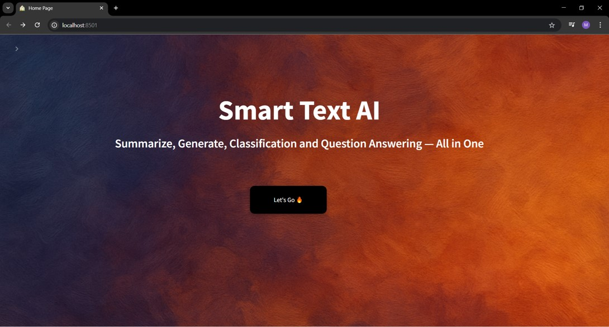
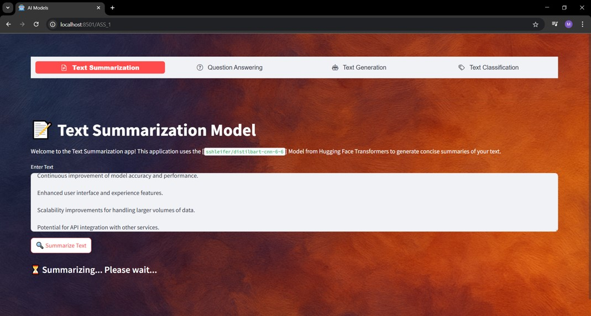

# Smart-AI-Text-Web-APP
Smart AI Text Web App helps you analyze and understand text using smart AI tools. You can input text directly or upload PDFs for processing. Explore powerful models for summarizing, generating, classifying, and answering questions. Navigate easily through the Home and Models pages for different use cases.

## Home Page

## Model Page

## 💡 Available Use Cases

1 - Text Classification 
  Classifying input texts into predefined categories.

2 - Text Generation
  Generating new text based on user input.

3 - Text Summarization
  Summarizing long texts into concise key points.

4 - Question Answering 
  Automatically extracting answers from input text.

